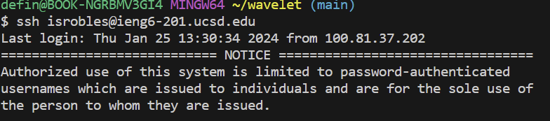
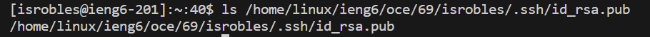
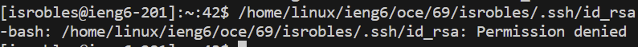

# Lab Report 2 - Isaac Robles
---
# Program code : 


`ChatServer.java`
```
import java.io.IOException;
import java.net.URI;

class ChatHandler implements URLHandler {
    private String chatMessages = "";

    public String handleRequest(URI url) {
        if (url.getPath().equals("/add-message")) {
            String queryString = url.getQuery();
            String[] parameters = queryString.split("&");
            String message = null;
            String user = null;

            for (String param : parameters) {
                String[] parts = param.split("=");
                if (parts.length == 2) {
                    if (parts[0].equals("s")) {
                        message = parts[1];
                    } else if (parts[0].equals("user")) {
                        user = parts[1];
                    }
                }
            }

            if (message != null && user != null) {
                String chatMessage = user + ": " + message + "\n";
                chatMessages = chatMessages + chatMessage;
            }

            return chatMessages;
        } else {
            return "404 Not Found!";
        }
    }
}

public class ChatServer {
    public static void main(String[] args) throws IOException {
        if (args.length == 0) {
            System.out.println("Missing port number! Try any number between 1024 to 49151");
            return;
        }

        int port = Integer.parseInt(args[0]);

        Server.start(port, new ChatHandler());
    }
}

```
`Server.java`
```
// A simple web server using Java's built-in HttpServer

// Examples from https://dzone.com/articles/simple-http-server-in-java were useful references

import java.io.IOException;
import java.io.OutputStream;
import java.net.InetSocketAddress;
import java.net.URI;

import com.sun.net.httpserver.HttpExchange;
import com.sun.net.httpserver.HttpHandler;
import com.sun.net.httpserver.HttpServer;

interface URLHandler {
    String handleRequest(URI url);
}

class ServerHttpHandler implements HttpHandler {
    URLHandler handler;
    ServerHttpHandler(URLHandler handler) {
      this.handler = handler;
    }
    public void handle(final HttpExchange exchange) throws IOException {
        // form return body after being handled by program
        try {
            String ret = handler.handleRequest(exchange.getRequestURI());
            // form the return string and write it on the browser
            exchange.sendResponseHeaders(200, ret.getBytes().length);
            OutputStream os = exchange.getResponseBody();
            os.write(ret.getBytes());
            os.close();
        } catch(Exception e) {
            String response = e.toString();
            exchange.sendResponseHeaders(500, response.getBytes().length);
            OutputStream os = exchange.getResponseBody();
            os.write(response.getBytes());
            os.close();
        }
    }
}

public class Server {
    public static void start(int port, URLHandler handler) throws IOException {
        HttpServer server = HttpServer.create(new InetSocketAddress(port), 0);

        //create request entrypoint
        server.createContext("/", new ServerHttpHandler(handler));

        //start the server
        server.start();
        System.out.println("Server Started!");
    }
}
```
---
# Part 1: 
*two examples of `/add-message` being used*


---

In the screenshots I provided above, the methods that seem to be called when a `/add-message` request is made are `handle` from `Server.java` and `handleRequest` from `ChatServer.java`.
There are many important parts of this code that should be taken into consideration. I would say the most relevant ones are the use of `getQuery`, `getPath` and the field `chatMessages`. The use of `getPath` allows for there to be a check for the `/add-message` request itself. Without this we wouldn't be able to know when a user wants to send a request as the path for it would not be found. The use of `getQuery` follows after and allows for the rest of the parameters that go hand in hand with the path to collaborate together. The method specifically extracts the query component of the URI, is separated by "&" symbols. This query string will then take specfic parameters which can be found in the for loop that comes after. ( `s` `user` `=` )

‎ 

```
for (String param : parameters) {
                String[] parts = param.split("=");
                if (parts.length == 2) {
                    if (parts[0].equals("s")) {
                        message = parts[1];
                    } else if (parts[0].equals("user")) {
                        user = parts[1];
```

---

The  most relevant field that is changed in the `ChatHandler` class from doing the `/add-message` request can be found in four lines of my code.


```
if (message != null && user != null) {
    String chatMessage = user + ": " + message + "\n";
    chatMessages = chatMessages + chatMessage;
return chatMessages;
```

---

Here we can see that, this is where each request message is being stored and updated each time a `/add-message` request is made. More specifcally `chatMessages` which is returned at the end is the field that is being updated each time said request is made and then displayed on the website.

---

# Part 2:

No Password Login:



---

Public Key:



---

Private Key:



---


# Part 3:

I would say quite literally everything I've learned in these weeks are something I didn't know before, but to be more specific I would say the use of the `ssh` command was the most fascinating. Being able to connect and see myself run commannds remotely onto a computer through my laptop's terminal was pretty cool. I was not aware something like this could be done so easily, I look forward to seeing how we use this component in future labs.

