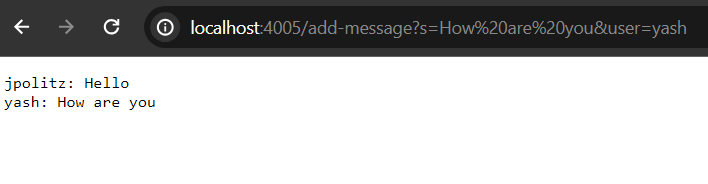
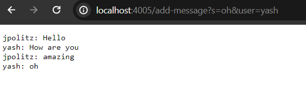
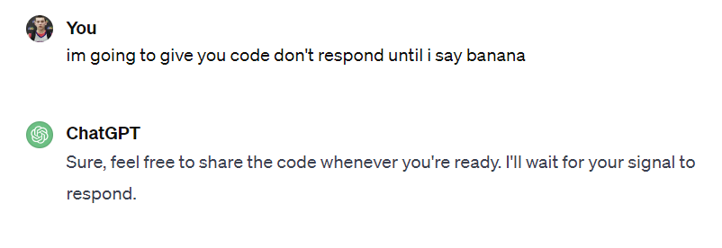
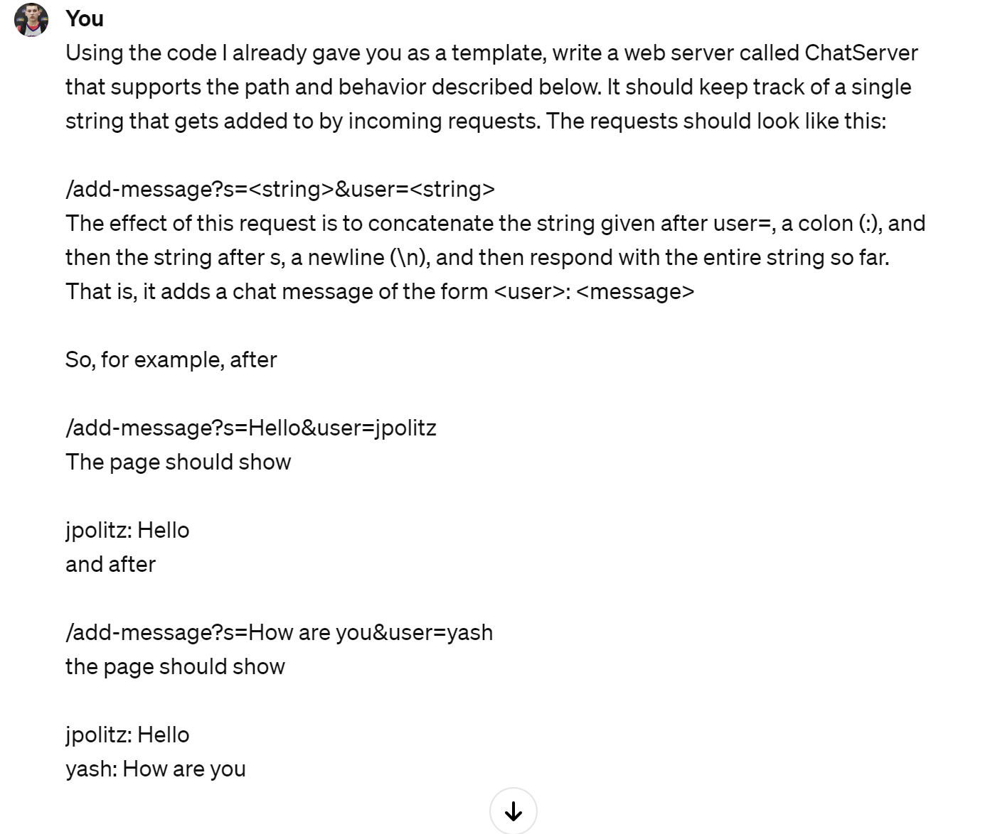
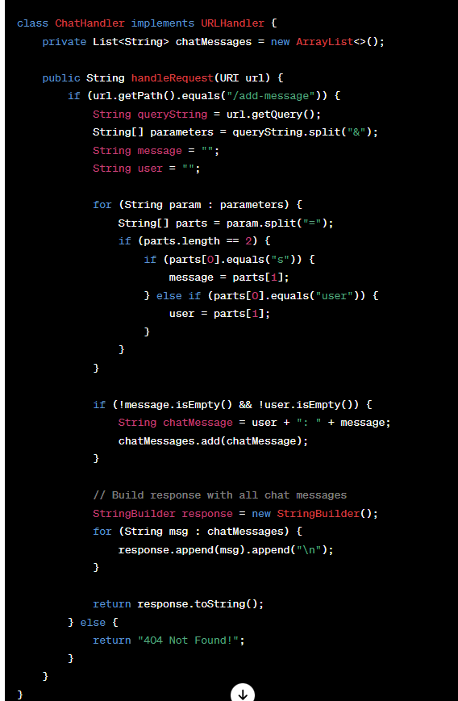
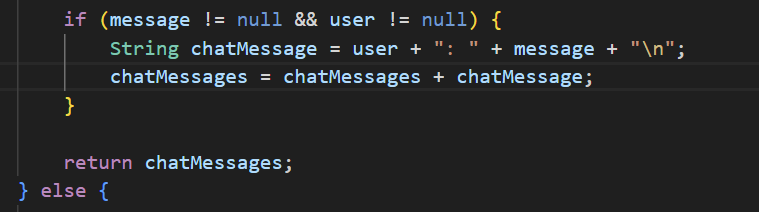

# Lab Report 2 - Isaac Robles
---
# Program code : 


`ChatServer.java`
```
import java.io.IOException;
import java.net.URI;

class ChatHandler implements URLHandler {
    private String chatMessages = "";

    public String handleRequest(URI url) {
        if (url.getPath().equals("/add-message")) {
            String queryString = url.getQuery();
            String[] parameters = queryString.split("&");
            String message = null;
            String user = null;

            for (String param : parameters) {
                String[] parts = param.split("=");
                if (parts.length == 2) {
                    if (parts[0].equals("s")) {
                        message = parts[1];
                    } else if (parts[0].equals("user")) {
                        user = parts[1];
                    }
                }
            }

            if (message != null && user != null) {
                String chatMessage = user + ": " + message + "\n";
                chatMessages = chatMessages + chatMessage;
            }

            return chatMessages;
        } else {
            return "404 Not Found!";
        }
    }
}

public class ChatServer {
    public static void main(String[] args) throws IOException {
        if (args.length == 0) {
            System.out.println("Missing port number! Try any number between 1024 to 49151");
            return;
        }

        int port = Integer.parseInt(args[0]);

        Server.start(port, new ChatHandler());
    }
}

```
`Server.java`
```
// A simple web server using Java's built-in HttpServer

// Examples from https://dzone.com/articles/simple-http-server-in-java were useful references

import java.io.IOException;
import java.io.OutputStream;
import java.net.InetSocketAddress;
import java.net.URI;

import com.sun.net.httpserver.HttpExchange;
import com.sun.net.httpserver.HttpHandler;
import com.sun.net.httpserver.HttpServer;

interface URLHandler {
    String handleRequest(URI url);
}

class ServerHttpHandler implements HttpHandler {
    URLHandler handler;
    ServerHttpHandler(URLHandler handler) {
      this.handler = handler;
    }
    public void handle(final HttpExchange exchange) throws IOException {
        // form return body after being handled by program
        try {
            String ret = handler.handleRequest(exchange.getRequestURI());
            // form the return string and write it on the browser
            exchange.sendResponseHeaders(200, ret.getBytes().length);
            OutputStream os = exchange.getResponseBody();
            os.write(ret.getBytes());
            os.close();
        } catch(Exception e) {
            String response = e.toString();
            exchange.sendResponseHeaders(500, response.getBytes().length);
            OutputStream os = exchange.getResponseBody();
            os.write(response.getBytes());
            os.close();
        }
    }
}

public class Server {
    public static void start(int port, URLHandler handler) throws IOException {
        HttpServer server = HttpServer.create(new InetSocketAddress(port), 0);

        //create request entrypoint
        server.createContext("/", new ServerHttpHandler(handler));

        //start the server
        server.start();
        System.out.println("Server Started!");
    }
}
```
---
# Part 1: 
*two examples of `/add-message` being used*




---

In the screenshots I provided above, the methods that seem to be called when a `/add-message` request is made are `handle` from `Server.java` and `handleRequest` from `ChatServer.java`.
There are many important parts of this code that should be taken into consideration. I would say the most relevant ones are the use of `getQuery`, `getPath` and the field `chatMessages`. The use of `getPath` allows for there to be a check for the `/add-message` request itself. Without this we wouldn't be able to know when a user wants to send a request as the path for it would not be found. The use of `getQuery` follows after and allows for the rest of the parameters that go hand in hand with the path to collaborate together. The method specifically extracts the query component of the URI, is separated by "&" symbols. This query string will then take specfic parameters which can be found in the for loop that comes after. ( `s` `user` `=` )


Relevant arguments from the handleRequest method include: `URI url:` This is the input parameter that represents the `URI` that the method is grabbing and processing. `String queryString` this string is taken from the URI, it represents the query part of the URL.  `String message`  holds the information provided for the "s" parameter in the query string. `String user` stores the data associated with the "user" parameter in the query string.

‎ 

```
for (String param : parameters) {
                String[] parts = param.split("=");
                if (parts.length == 2) {
                    if (parts[0].equals("s")) {
                        message = parts[1];
                    } else if (parts[0].equals("user")) {
                        user = parts[1];
```

---

The  most relevant field that is changed in the `ChatHandler` class from doing the `/add-message` request can be found in four lines of my code.


```
if (message != null && user != null) {
    String chatMessage = user + ": " + message + "\n";
    chatMessages = chatMessages + chatMessage;
return chatMessages;
```

---

Here we can see that, this is where each request message is being stored and updated each time a `/add-message` request is made. More specifcally `user` and `message` are being changed and returned concatenated with eachouther through `chatMessage` which is returned at the end and is being updated each time said request is made and then displayed on the website. `chatMessage`  is changed by concatenated the `user` and `message`  along with a colon and a newline. For example, if user is` "isaac" `it'll become `isaac:`, and if the message is `hi` it'll then become `isaac: hi` and then chatMessages will be updated and return `isaac: hi`.

---

# Part 2:

First I will run `$ssh key-gen` to create the public and private keys. We will see that they are stored in the `/.ssh/` directory. 

```
Your identification has been saved in /c/Users/defin/.ssh/id_ed25519
Your public key has been saved in /c/Users/defin/.ssh/id_ed25519.pub
The key fingerprint is:
SHA256:p/sk8gHNBParPM0p9Rq1ImQCFSzlv6P2MRln2O8vE18 defin@BOOK-NGRBMV3GI4
The key's randomart image is:
+--[ED25519 256]--+
|   o+.o          |
|  .o.. o         |
|  ...   o        |
|   . . * .       |
|    . B S o      |
|     = % B..  E  |
|      & X =o .   |
|    .. X Xo .    |
|   .... +.o+.    |
+----[SHA256]-----+
```

Next we move into the `/.ssh/` directory, where we can use the `ls` the files where the public and private key are stored. 

```
defin@BOOK-NGRBMV3GI4 MINGW64 ~
$ cd /c/Users/defin/.ssh/

defin@BOOK-NGRBMV3GI4 MINGW64 ~/.ssh
$ ls
id_ed25519  id_ed25519.pub  known_hosts

```

We can then get the absolute path to the private/public keys by running ls with the files we found.

```
defin@BOOK-NGRBMV3GI4 MINGW64 ~/.ssh
$ ls /c/Users/defin/.ssh/id_ed*
/c/Users/defin/.ssh/id_ed25519  /c/Users/defin/.ssh/id_ed25519.pub
```
There are the two paths to the public/privat key. The path with.pub is the public key and the private is the other path. Down below I will include myself logging into the remote machine without being asked for a password.

```
defin@BOOK-NGRBMV3GI4 MINGW64 ~/.ssh
$ ssh isrobles@ieng6-201.ucsd.edu
Last login: Sun Feb 11 23:14:16 2024 from 128.54.214.177
quota: Cannot resolve mountpoint path /home/linux/dsmlp/.snapshot/daily.2024-01-12_0010: Stale file handle
quota: Cannot resolve mountpoint path /home/linux/ieng6/cs120wi24/cs120wi24dx/.snapshot/hourly.2024-01-29_1201: Stale file handle
Hello isrobles, you are currently logged into ieng6-201.ucsd.edu

You are using 0% CPU on this system

Cluster Status 
Hostname     Time    #Users  Load  Averages  
ieng6-201   23:15:01   5  0.33,  0.55,  0.49
ieng6-202   23:15:01   2  0.03,  0.20,  0.31
ieng6-203   23:15:01   6  0.12,  0.39,  0.74

 

To begin work for one of your courses [ cs15lwi24 ], type its name
at the command prompt.  (For example, "cs15lwi24", without the quotes).

To see all available software packages, type "prep -l" at the command prompt,
or "prep -h" for more options.
[isrobles@ieng6-201]:~:52$
```


# Part 3:

I would say quite literally everything I've learned in these weeks are something I didn't know before, but to be more specific I would say the use of the `ssh` command was the most fascinating. Had no clue my computer had keys specific to it that could be used this way, to for example skip logging in. Being able to connect and see myself run commands remotely onto a computer through my laptop's terminal was overall pretty cool. I was not aware something like this could be done so easily, I look forward to seeing how we use this component in future labs.

‎ 

---

# Chat GPT:





---

For some reason it was importing ArrayList/Lists to make the code. I felt like this wasn't necessary so I tweaked the code a little to get rid of that. I got rid of the imports included at that top and simply wrote `private String chatMessages = "";` instead of the List originally there. Honestly had no clue how to use the query methods until I saw it written out in front of me by ChatGPT. I feel like I am lacking in knowledge surrounding java syntax and it's nice that I am able to use AI like this.

---

Also had to tweak everything after the first for loop as it was making use of things that can only be used when importing ArrayLists/Lists. 


‎
‎ 

Much easier to read and understand from my perspective by writing this part of the code like this, the code that was there prior was much more confusing and made use of those imports that were not needed as I talked about earlier. 

---


